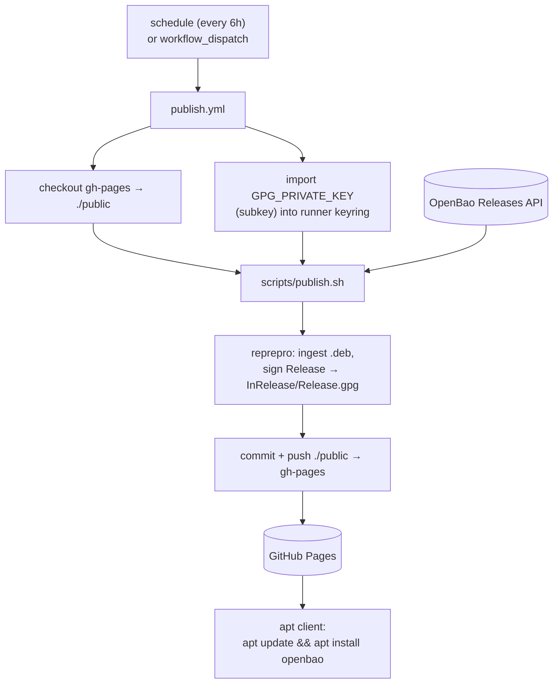
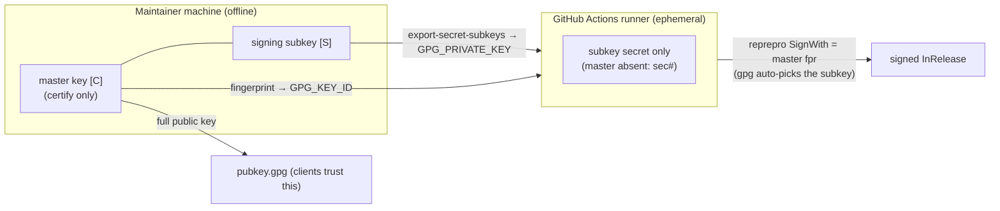
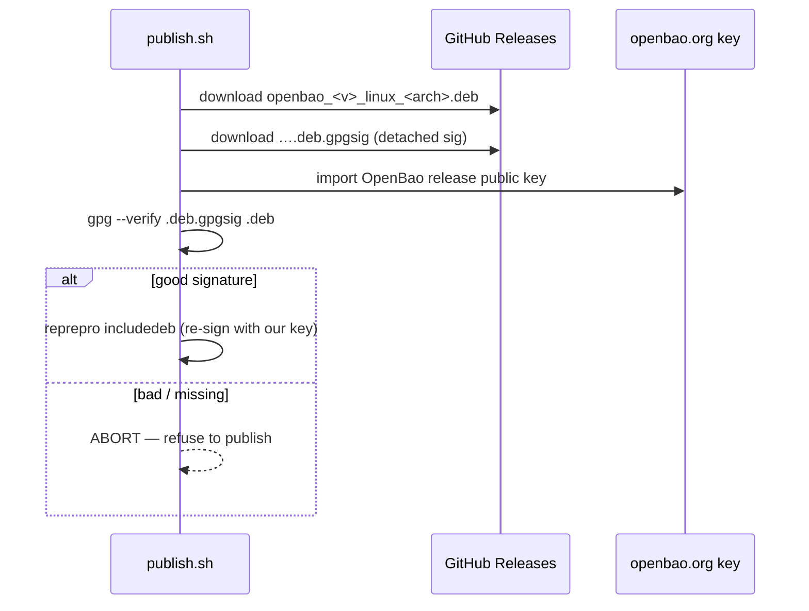
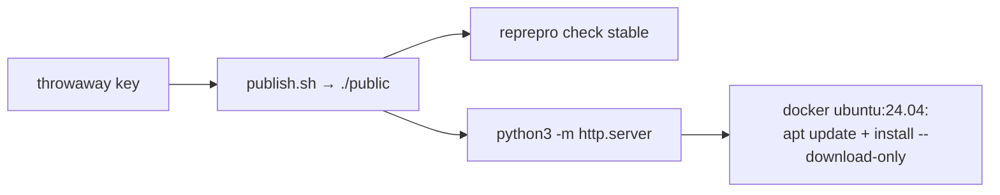

# Developers Guide — how it all flows

The design, the data flow, and the internals — enough to modify any part with confidence.
For commands see [Quick-Start](quick-start.md) and [Operations](operations.md).

---

## 1. The problem this solves

There is no official OpenBao apt repository; Debian/Ubuntu users must manually `dpkg -i` a
`.deb` from GitHub Releases, with no auto-update. This project turns those releases into a
**signed apt repository on GitHub Pages**, refreshed automatically, so hosts get
`apt install openbao` and ongoing upgrades.

Everything is **static hosting + a scheduled job**: no server, no database service, no
always-on infrastructure. The published apt repo *is* a directory of files on a git branch.

---

## 2. Components and where state lives

| Thing | Where | Holds |
| --- | --- | --- |
| Source | `main` branch | workflow, scripts, reprepro config template, docs |
| Published apt repo | `gh-pages` branch | `pubkey.gpg`, `dists/`, `pool/`, `index.html`, plus reprepro's `conf/` + `db/` |
| Web server | GitHub Pages (branch `gh-pages`, root) | serves the above over HTTPS |
| Automation | GitHub Actions (`publish.yml`) | runs `publish.sh` on a schedule |
| Master signing key `[C]` | the maintainer's GPG keyring (offline) | identity; never on GitHub |
| CI signing subkey `[S]` | Actions secret `GPG_PRIVATE_KEY` | signs `InRelease` in CI |
| Upstream binaries | github.com/openbao/openbao Releases | the `.deb`s we mirror |

Key idea: **`gh-pages` is the single source of truth for published state.** reprepro keeps its
incremental bookkeeping (`db/`) right there, so each run is a small diff rather than a full
rebuild — and there is no separate datastore to back up.

---

## 3. End-to-end flow



The workflow itself (`publish.yml`) is thin: install reprepro, materialise `gh-pages` into
`./public`, import the signing subkey into an ephemeral runner keyring, run `publish.sh`, then
commit and push. It needs only `contents: write` (branch-based Pages requires no deploy step).

---

## 4. Inside `publish.sh`

`publish.sh` is deliberately **git-free** — it only builds the `./public` tree, which makes it
runnable locally (that's exactly what `test-local.sh` does). Steps:

1. **Resolve the signing key.** Use `GPG_KEY_ID` (the master fingerprint) if set, else derive
   it; the runner keyring already holds the subkey secret.
2. **Render config.** Substitute `${GPG_KEY_ID}` into
   [`conf/distributions.tmpl`](../conf/distributions.tmpl) → `public/conf/distributions`.
3. **Snapshot existing state** via `reprepro list stable` (so we don't re-download what's
   already published).
4. **Select releases.** Query the Releases API, keep non-draft/non-prerelease tags
   ≥ `MIN_VERSION`, newest `KEEP_VERSIONS`.
5. **Download + verify.** For each {version}×{arch}×{package}, download the `.deb`, then —
   unless `VERIFY_UPSTREAM=0` — verify it against its upstream `*.deb.gpgsig` (see §6). A
   failed verification **aborts the run**.
6. **Ingest.** `reprepro includedeb stable <deb>` adds the package and re-signs the suite.
7. **Root assets.** Write `pubkey.gpg` (armored public key), `.nojekyll`, and `index.html`.

The matrix mirrored: packages `openbao` + `openbao-hsm`, architectures `amd64` + `arm64`,
downloaded from
`https://github.com/openbao/openbao/releases/download/v<ver>/<pkg>_<ver>_linux_<arch>.deb`.

---

## 5. The signing model — offline master + CI subkey



Why this shape:

- The **master `[C]` never leaves the maintainer's keyring.** Only the **subkey `[S]`** is
  exposed to CI. If the runner/secret is compromised, you revoke just the subkey with the
  master and rotate — the identity (and the client-facing apt source line) is unchanged.
- `SignWith` in `conf/distributions` is the **master fingerprint**; gpg automatically signs
  with the available signing subkey. In CI the master secret is absent (`sec#`), so signing
  *must* use the subkey — verified behaviour, not luck.
- The signing key is **passphrase-less** (CI must sign non-interactively). That's an accepted
  trade-off because the only copy CI holds is a revocable subkey; the master can carry a
  passphrase locally.

Set up by [`setup-signing.sh`](../scripts/setup-signing.sh); rotated by
[`rotate-signing-key.sh`](../scripts/rotate-signing-key.sh) (which verifies the postcondition
of every step and self-tests a signature with the new subkey before touching GitHub).

Clients trust **our** signature via the pinned `signed-by=/usr/share/keyrings/openbao-cs.gpg`.
Because the `.deb`s live in our own `pool/`, apt never makes a cross-origin fetch.

---

## 6. Supply-chain verification

Before any `.deb` is re-signed and republished, `publish.sh` proves it's the genuine upstream
artifact:



This closes the gap between "downloaded from GitHub" and "served to our users". The upstream
key comes from `OPENBAO_GPG_KEY_URL`
(default `https://openbao.org/assets/openbao-gpg-pub-20240618.asc`).

---

## 7. reprepro behaviour worth knowing

- **One version per package/arch.** reprepro replaces an older version with a newer one on
  ingest and prunes the old `.deb` from `pool/`. So the repo always serves the latest;
  multi-version retention is *not* a reprepro feature (it was an early misassumption — there is
  no `Limit` field). `KEEP_VERSIONS` therefore defaults to `1`.
- **Layout produced:** `dists/stable/` (the signed `InRelease`, `Release`, `Release.gpg`, and
  per-arch `Packages`), and `pool/main/o/openbao/…` for the binaries.
- **`conf/` and `db/`** live on `gh-pages` too. They're not sensitive (the private key is never
  there) and `db/` is what makes incremental publishing possible.
- The HSM build is just another Debian package name (`openbao-hsm`); clients pick it with
  `apt install openbao-hsm`.

---

## 8. Local development & testing

```bash
scripts/test-local.sh
```

What it exercises (no GitHub, no real key, your keyring untouched):



Override the same env knobs to scope a run, e.g. `ARCHES=amd64 PACKAGES=openbao
KEEP_VERSIONS=1 scripts/test-local.sh` for a quick single-package smoke test.

GPG-affecting scripts and tests always drive gpg with `--pinentry-mode loopback` so no desktop
pinentry dialog appears; key-modifying operations that need a terminal (e.g. `--edit-key`
during revocation) work in a normal interactive shell.

---

## 9. Extending it

- **New architecture:** add to `Architectures:` in `conf/distributions.tmpl` *and* to `ARCHES`.
- **New package:** add its basename to `PACKAGES` (must exist as an upstream `<pkg>_<ver>_linux_<arch>.deb`).
- **Second suite/component:** extend `conf/distributions.tmpl` with another stanza and teach
  `publish.sh` which suite to `includedeb` into.
- **Different cadence:** edit the `cron` in `publish.yml`.

Keep `publish.sh` git-free so `test-local.sh` stays representative; keep the master key out of
CI; keep upstream verification on.
